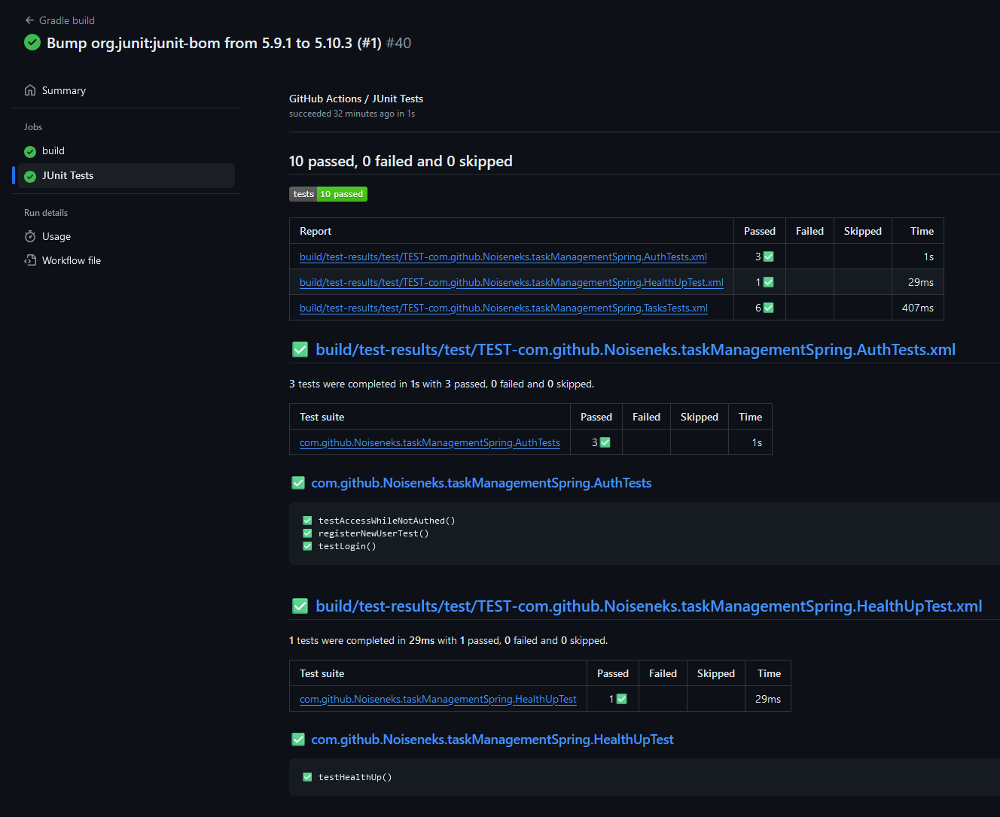

# Task Management Spring

Пример тестового бэкенда для системы управления задачами

## Запуск
Рекомендуется использование Java 17. В репозитории содержится Dockerfile для локального запуска проекта. 
Также никто не запрещает запустить его прямо из среды разработки, предварительно указав ENV переменные

## Использование
### Регистрация и логин
Так как фронтенд отсутствует, вам придётся довольствоваться программой PostMan и её невероятно красивым интерфейсом.

Доступ ко всему, кроме Swagger и регистрации, требует наличия аккаунта, так что его предварительно требуется создать
через метод `localhost:8080/auth/signup` (если запуск производится на локали):


Передача данных идёт через json, пример которого ниже предоставлю для удобства:
```json
{
    "email": "testemail@gmail.com",
    "password": "wonderful"
}
```
В ответе мы получим JWT токен, который понадобится нам для доступа ко всем остальным действиям

### Создание и изменение задач
Запрос на создание можно выполнить с использованием метода POST `localhost:8080/tasks/createTask` json'а следующего формата:
```json
{
    "name": "Сделай кофе",
    "priority": "HIGH"
}
```
(На самом деле можно предоставить также и другие поля, но обязательным из них является только `name`)
После создания задачи в ответе мы получим её объект. Её айди нам будет нужен, если мы захотим оставить комментарий или изменить задачу:


Так, для примера, с использованием метода PATCH `localhost:8080/tasks/editTask` установим задаче высокий приоритет, а статус пометим как "выполненное":

В ответе получим всё ту же задачу, но с дополненными и изменёнными полями.

Для справки укажу также, что метод DELETE `localhost:8080/tasks/deleteTask` позволяет удалить задачу, подробнее можно узнать через Swagger UI, по умолчанию доступный через
http://localhost:8080/swagger-ui/index.html


### Комментирование задач
Сервис также позволяет оставлять, изменять и удалять комментарии к задачам. Способы работы с ними аналогичны подобным для тасков.
Так, к примеру, метод POST `localhost:8080/tasks/addComment` позволяет оставить комментарий к задаче, если использовать json подобного вида:
```json
{
  "id": 12,
  "text": "Текст комментария"
}
```

## Тесты
Для удобства возможных будущих разработок, были написаны тесты основных функций сервиса, а также добавлены Github Actions,
дающие информацию о них.

